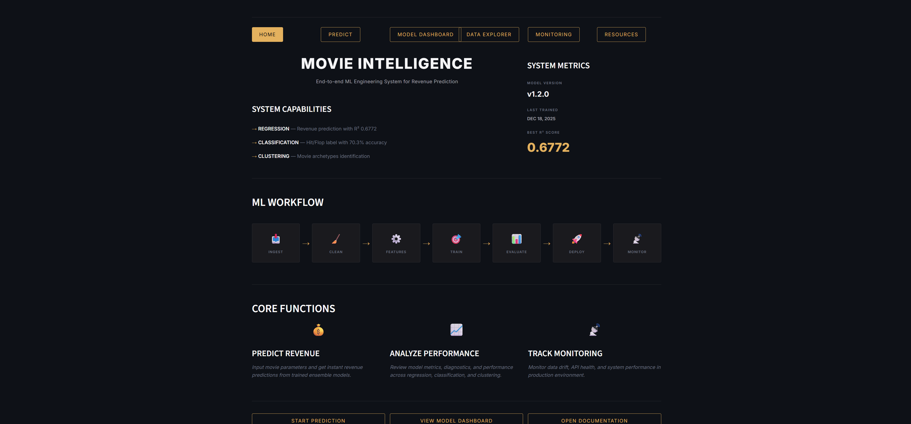
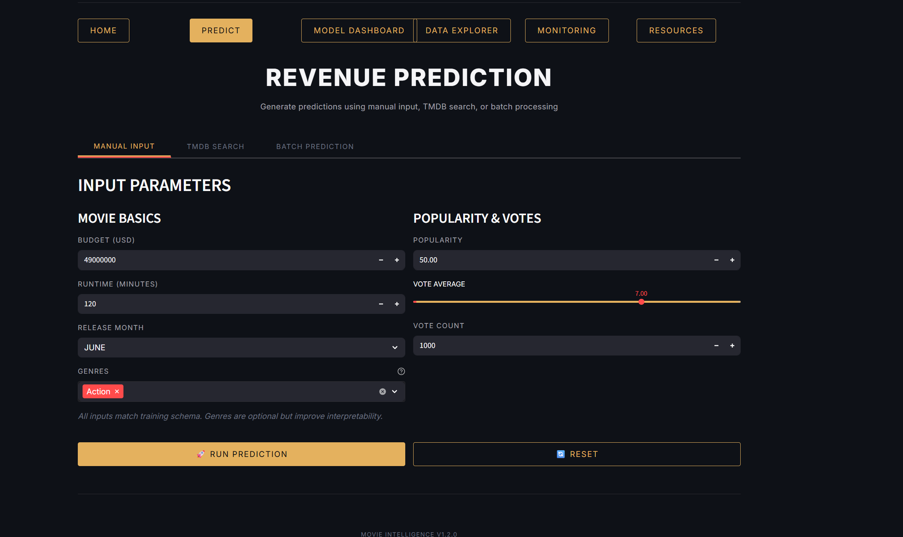
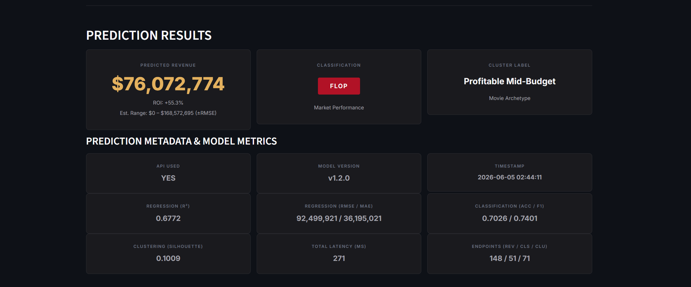

# 🎬 Movie Revenue Predictor

Not a notebook. A full ML system with three prediction tasks, a live dashboard, orchestrated pipelines, and CI/CD. Built solo.

🔗 **[Live Demo on Hugging Face Spaces](https://huggingface.co/spaces/DaraBodla/Movie-Intelligence)**

---

## screenshots





---

## what it does

Takes movie metadata and returns three things at once: a revenue prediction, a hit/flop classification, and a movie archetype cluster. The model version is v1.2.0, last trained December 2025.

You can run predictions three ways: manual input, TMDB search by movie title, or batch processing a CSV.

---

## architecture

```
┌─────────────────────────────────────────────────────────┐
│                   Streamlit Dashboard                    │
│     Home · Predict · Model Dashboard · Data Explorer     │
│              Monitoring · Resources                      │
└────────────────────────┬────────────────────────────────┘
                         │
┌────────────────────────▼────────────────────────────────┐
│                    FastAPI Backend                        │
│         /predict/revenue  /predict/classification        │
│                  /predict/clustering                     │
└────────────────────────┬────────────────────────────────┘
                         │
┌────────────────────────▼────────────────────────────────┐
│              Ensemble Model Layer                         │
│     XGBoost  ·  LightGBM  ·  CatBoost  →  Meta-learner  │
└────────────────────────┬────────────────────────────────┘
                         │
┌────────────────────────▼────────────────────────────────┐
│             Prefect Pipeline Orchestration                │
│       ingest → preprocess → train → evaluate → save      │
└─────────────────────────────────────────────────────────┘
```

---

## results

| Task | Metric | Score |
|---|---|---|
| Regression | R² | 0.6772 |
| Regression | RMSE | $92,499,921 |
| Regression | MAE | $36,195,021 |
| Classification | Accuracy | 70.26% |
| Classification | F1 | 0.7401 |
| Clustering | Silhouette | 0.1009 |
| Inference | Latency | 271ms |

---

## stack

| Layer | Tools |
|---|---|
| Models | XGBoost · LightGBM · CatBoost |
| API | FastAPI · Uvicorn · Pydantic |
| Orchestration | Prefect |
| Dashboard | Streamlit |
| Containers | Docker · Docker Compose |
| CI/CD | GitHub Actions |
| Data | Pandas · NumPy · scikit-learn |

---

## project structure

```
movie-revenue-predictor/
├── api/
│   ├── main.py              # FastAPI app
│   ├── schemas.py           # request/response models
│   └── routes/
│       ├── predict.py
│       └── metrics.py
├── pipeline/
│   ├── ingest.py
│   ├── preprocess.py
│   ├── train.py
│   └── evaluate.py
├── models/
│   └── ensemble.py
├── dashboard/
│   └── app.py
├── .github/
│   └── workflows/
│       └── ci.yml
├── Dockerfile
├── docker-compose.yml
└── requirements.txt
```

---

## quickstart

**Docker**

```bash
git clone https://github.com/DaraBodla/movie-revenue-predictor.git
cd movie-revenue-predictor
docker-compose up --build
```

API at `http://localhost:8000`
Dashboard at `http://localhost:8501`

**Local**

```bash
pip install -r requirements.txt

uvicorn api.main:app --reload

streamlit run dashboard/app.py

python -m pipeline.train
```

---

## API

**POST /predict/revenue**

```json
{
  "budget": 49000000,
  "runtime": 120,
  "release_month": "June",
  "genres": ["Action"],
  "popularity": 50.0,
  "vote_average": 7.0,
  "vote_count": 1000
}
```

```json
{
  "predicted_revenue": 76072774,
  "roi": 55.3,
  "classification": "Flop",
  "cluster_label": "Profitable Mid-Budget",
  "model_version": "v1.2.0"
}
```

---

## CI/CD

Every push to `main` runs lint, tests, builds the Docker image, deploys, and hits a smoke test. Retraining is on a Prefect schedule. A new model only gets promoted if it beats the current one on held-out eval.

---

## built by

[Dara Bodla](https://github.com/DaraBodla)
